<p align="center">
  
</p>

<h1 align="center">MNIST Digit Classification with CNNs</h1>

<p align="center">
  <a href="https://www.python.org/"></a>
  <a href="https://pytorch.org/"></a>
  <a href="https://opensource.org/licenses/MIT"></a>
</p>

---

## 📜 Table of Contents

- [Project Overview](#project-overview)
- [Technology Stack](#technology-stack)
- [File Structure](#file-structure)
- [Understanding CNNs](#understanding-cnns)
- [Model Architectures](#model-architectures)
- [How to Run](#how-to-run)
- [Results & Analysis](#results--analysis)
- [Comparative Analysis](#comparative-analysis)
- [Illustrations](#illustrations)
- [Contributors](#contributors)
- [License](#license)

---

## 📖 Project Overview

This project demonstrates high-performance Convolutional Neural Networks (CNNs) for classifying handwritten digits from the MNIST dataset. The codebase is modular and designed for clarity, scalability, and experimentation.

> **Pipeline Overview**
>
>  

---

## 🚀 Technology Stack

| Python | PyTorch | torchvision | matplotlib | uv |

---

## 📁 File Structure

```plaintext
.
├── data_loader.py       # MNIST dataset downloading, transformation, loading
├── model_v1.py          # DS_CNN_V1 model definition
├── model_v2.py          # DS_CNN_V2 model definition
├── model_v3.py          # DS_CNN_V3 model definition
├── train.py             # Training and evaluation logic
├── main.py              # Orchestrates training/evaluation for all models
└── Images/              # Plots, architecture diagrams, sample outputs
```

---

## 🧠 Understanding CNNs

### What is a CNN?
A Convolutional Neural Network excels at analyzing image data. It learns hierarchical features using layers such as convolution, pooling, and fully-connected layers.

> 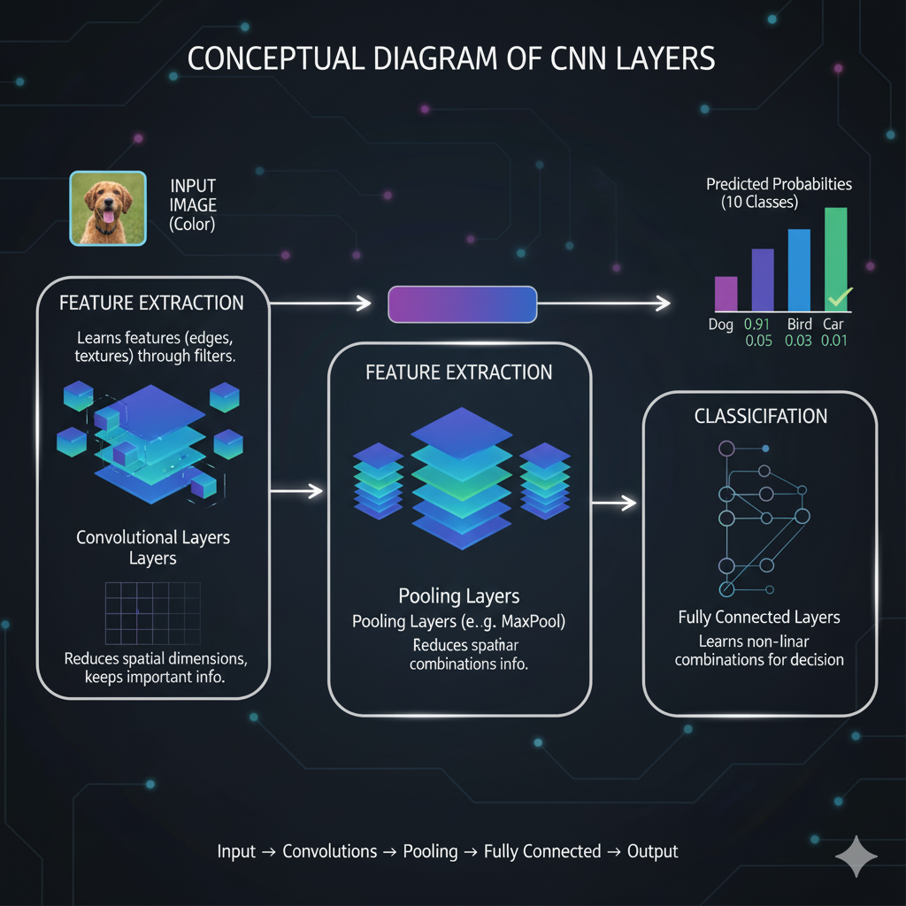 

### The MNIST Dataset
MNIST is a benchmark dataset of 70,000 handwritten digits (0-9), each a 28x28 pixel grayscale image.

>  <!-- Placeholder: Insert sample images of MNIST digits -->

### Key Neural Network Layers
- **`nn.Conv2d`**: Extracts features using convolutional kernels.
- **`nn.MaxPool2d`**: Downsamples feature maps for spatial invariance.
- **`nn.AdaptiveAvgPool2d`**: Aggregates features to fixed size.
- **`nn.Linear`**: Final classification into digit classes.

---

## 🏗️ Model Architectures

> **Visual Comparison of Architectures**
>
> 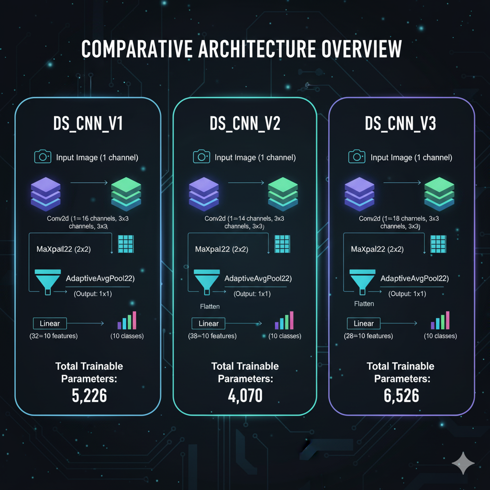 <!-- Placeholder: Visual comparison of the three architectures -->

### Model 1: DS_CNN_V1
- **Parameters:** 5,226
- **Architecture:**
  | Layer              | Details                                  |
  |--------------------|------------------------------------------|
  | Conv2d             | 1→16 channels, 3x3 kernel                |
  | MaxPool2d          | 2x2 kernel                               |
  | Conv2d             | 16→32 channels, 3x3 kernel               |
  | MaxPool2d          | 2x2 kernel                               |
  | AdaptiveAvgPool2d  | Output: (1, 1)                           |
  | Linear             | 32→10 features                           |

  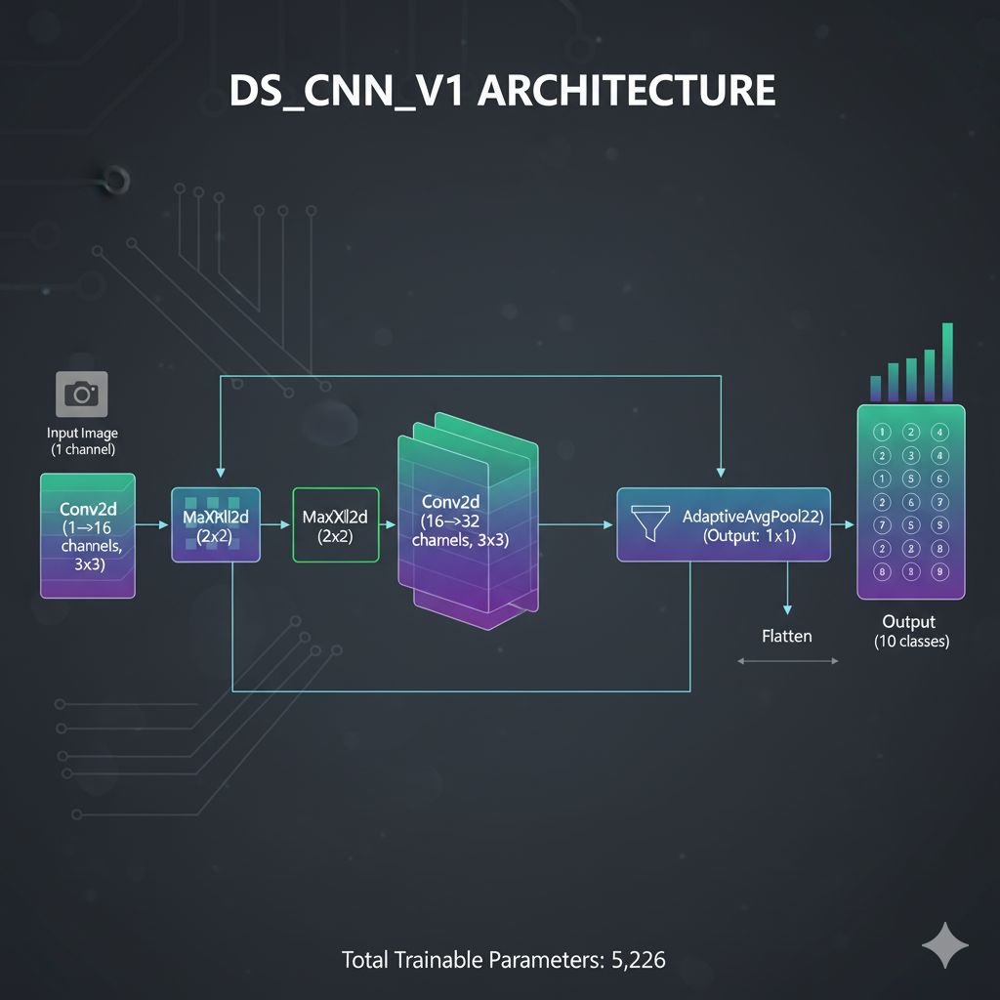 <!-- Placeholder -->

### Model 2: DS_CNN_V2
- **Parameters:** 4,070
- **Architecture:**
  | Layer              | Details                                  |
  |--------------------|------------------------------------------|
  | Conv2d             | 1→14 channels, 3x3 kernel                |
  | MaxPool2d          | 2x2 kernel                               |
  | Conv2d             | 14→28 channels, 3x3 kernel               |
  | MaxPool2d          | 2x2 kernel                               |
  | AdaptiveAvgPool2d  | Output: (1, 1)                           |
  | Linear             | 28→10 features                           |

  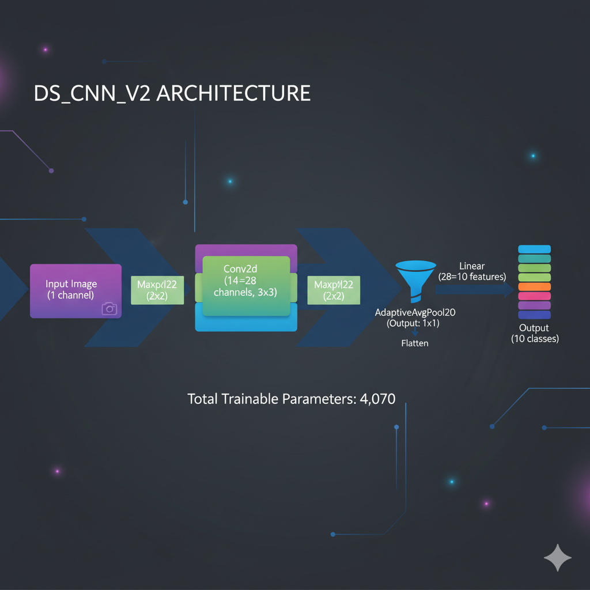 <!-- Placeholder -->

### Model 3: DS_CNN_V3
- **Parameters:** 6,526
- **Architecture:**
  | Layer              | Details                                  |
  |--------------------|------------------------------------------|
  | Conv2d             | 1→18 channels, 3x3 kernel                |
  | MaxPool2d          | 2x2 kernel                               |
  | Conv2d             | 18→36 channels, 3x3 kernel               |
  | MaxPool2d          | 2x2 kernel                               |
  | AdaptiveAvgPool2d  | Output: (1, 1)                           |
  | Linear             | 36→10 features                           |

  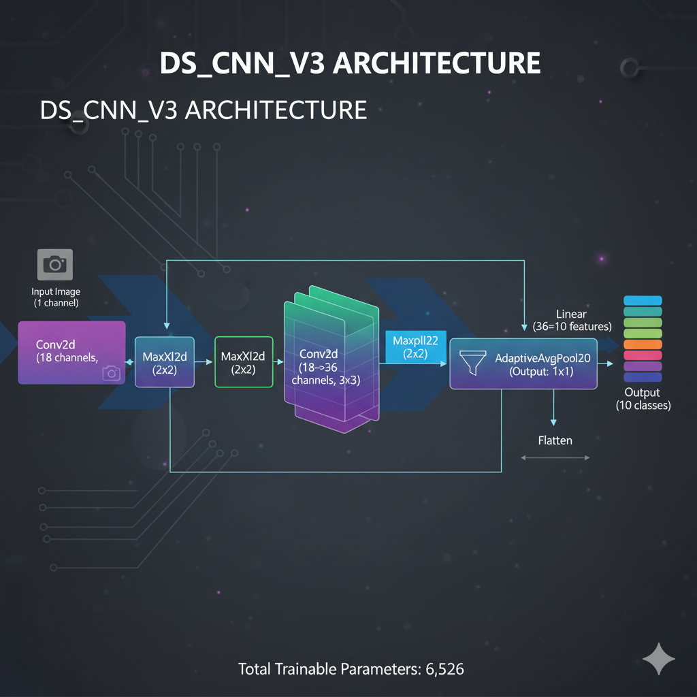 <!-- Placeholder -->

---

## ⚙️ How to Run

```bash
# Clone the repository
git clone https://github.com/Remo-Consultants/Session_6.git
cd Session_6

# Set up the environment (requires 'uv')
uv venv

# Activate the environment
# Windows
.venv\Scripts\activate
# macOS/Linux
source .venv/bin/activate

# Install dependencies
uv pip install torch torchvision matplotlib
```

```bash
# Run the main script
python main.py
```

> 

---

## 📈 Results & Analysis

Each model was trained for 15 epochs. Key results:

### DS_CNN_V1
- 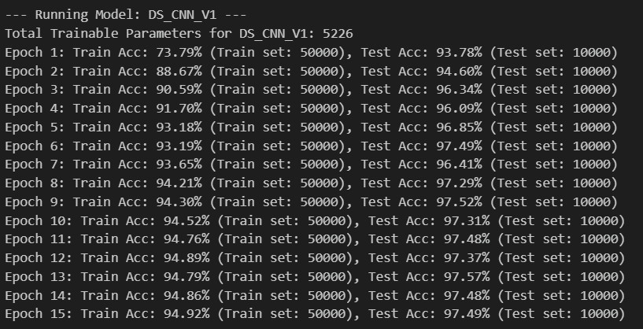
- 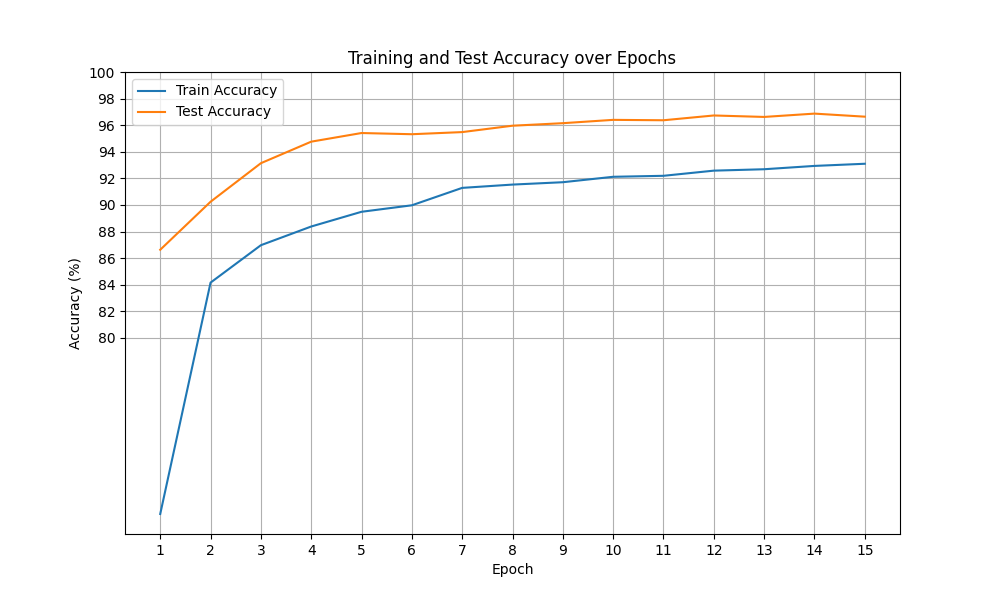

### DS_CNN_V2
- 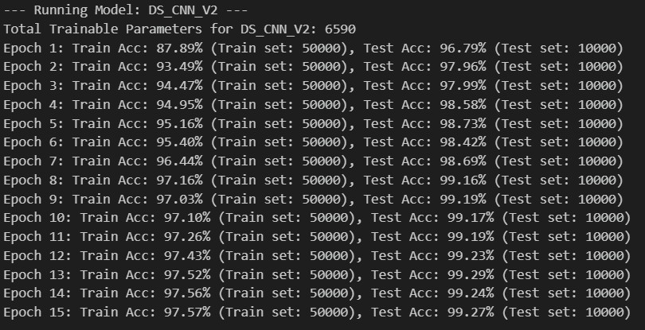
- 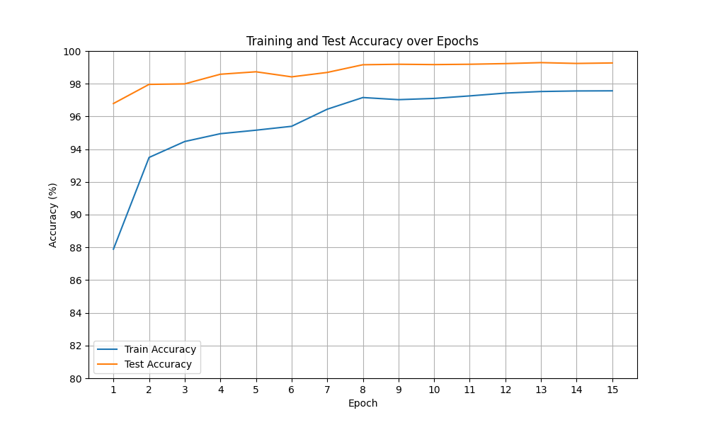

### DS_CNN_V3
- 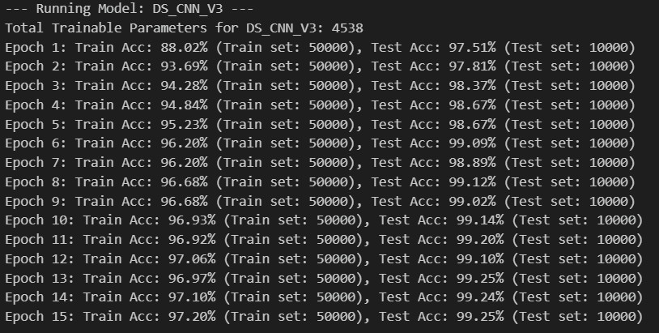
- 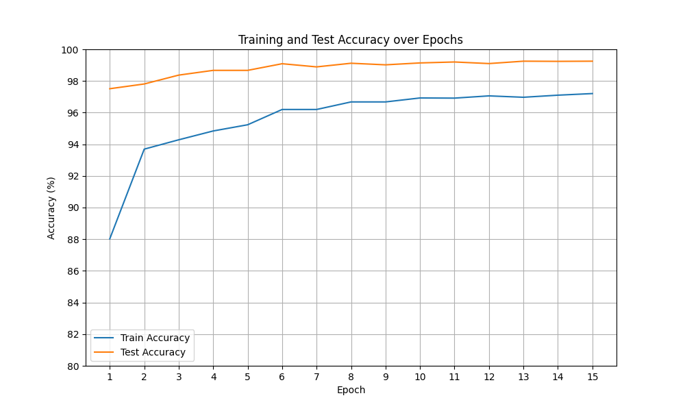

> 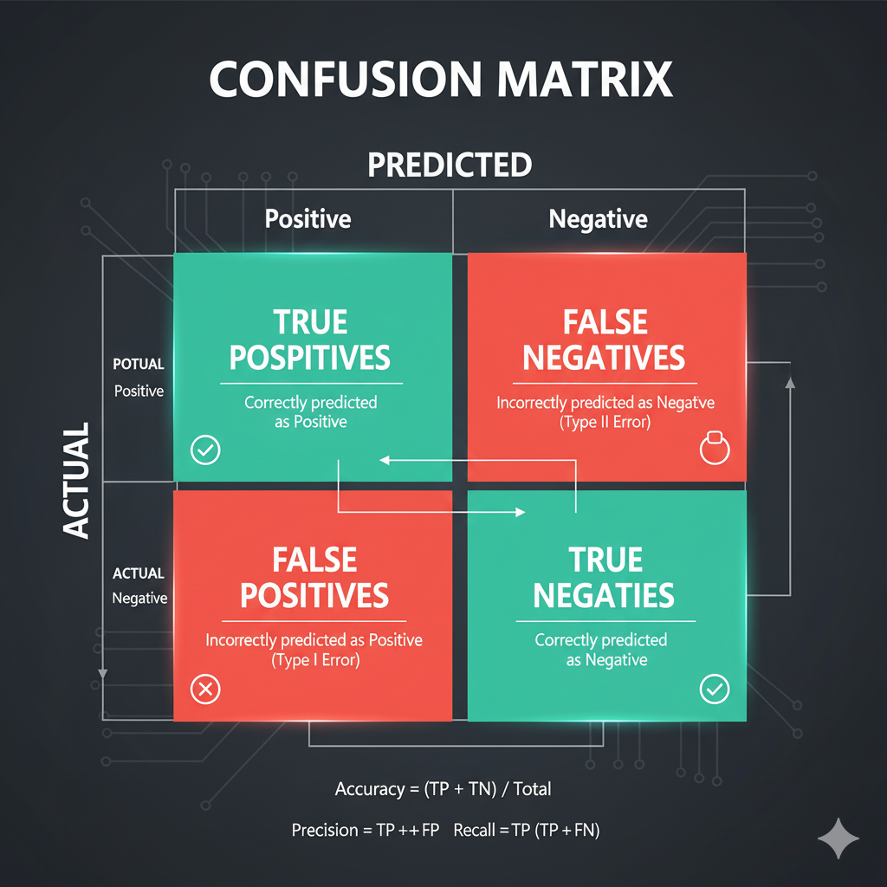 

---

## 🏆 Comparative Analysis

| Model      | Parameters | Final Test Accuracy | Key Features                   |
|------------|------------|--------------------|--------------------------------|
| DS_CNN_V1  | 5,226      | 97.49%             | Baseline, simplest             |
| DS_CNN_V2  | 4,070      | 99.27%             | Efficient, high accuracy       |
| DS_CNN_V3  | 6,526      | 99.25%             | Most expressive, excellent acc |

> **Conclusion:**  
> All three models achieve impressive accuracy; Model 2 (DS_CNN_V2) stands out for its balance of efficiency and performance.

---

## 📄 License

This project is licensed under the [MIT License](LICENSE).  


---
